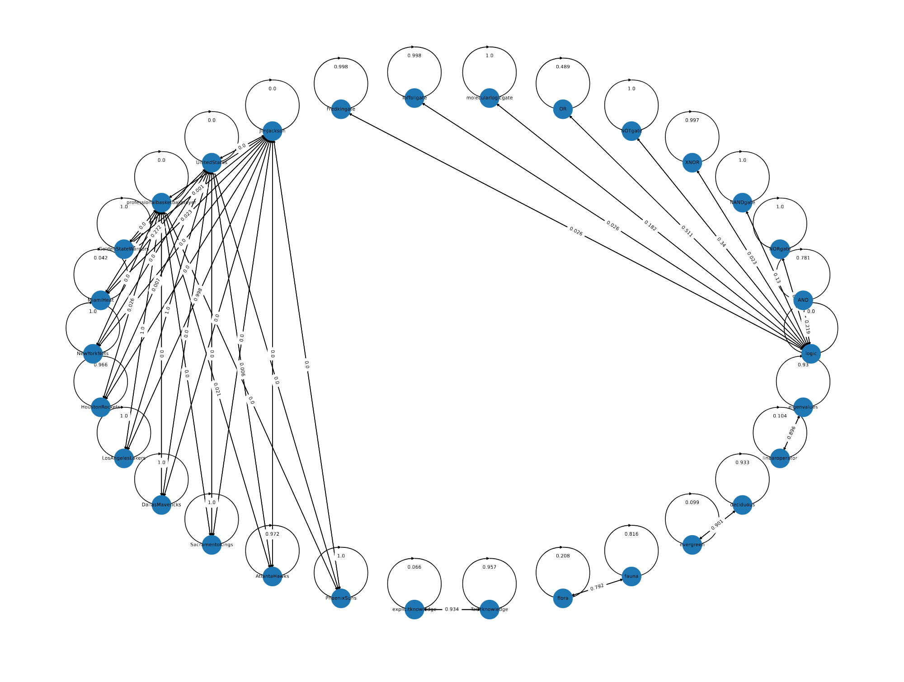

## Graph Convolution Simulator (GCS)

Source code for "[What Has Been Enhanced in my Knowledge-Enhanced Language Model?](https://arxiv.org/abs/2202.00964)"

Below is a simple demo to use GCS. We have prepared a toy knowledge graph and its entity representations of RoBERTa and K-Adapter. 

Here is the visualized results for the toy example:



As proved in our paper, GCS works stably, and there is no need to fix the random seeds. Users can try multiple times with similar conclusions: simple knowledge triples are integerated well, while for complex triples, only few of them can be successfully integrated.

---

### Requirements:

[PyTorch](https://pytorch.org/get-started/locally/) and [DGL](https://www.dgl.ai/pages/start.html) should be installed based on your system. For other libraries, you can install them using the following command:

    $ pip install -r requirements.txt

### Run Knowledge Integration Interpretation by using GCS on example data:

    $ bash run_example.sh

Interpretation results are saved in `./example/example_data/gcs.edgelist`. 

If the knowledge graph is small, users can visualize it by `./example/example_data/results.pdf`. 

---

### Run Knowledge Intergration Interpretation by GCS for your own model

#### Step 1: Prepare the entity embedding of vanilla LM and knowledge-enhanced LM:
Store them as PyTorch tensor (.pt) format. Make sure they have the same number of rows, and the indexes of entities are the same. The default files are `emb_roberta.pt` and `emb_kadapter.pt`.

#### Step 2: Prepare the knowledge graph:
Three files are needed to load the knowledge graph:

* a) `qid2idx.json`: The index dictionary. The key is entity Q-label, and value is the index of entity in entity embedding
* b) `qid2label.json` : The label dictionary. The key is entity Q-label, and the value is the entity label text. Note that this dictionary is only for visualization, you can set it as {Q-label: Q-label} if you don't have the text.
* c) `kg.edgelist`: The knowledge triple to construct knowledge graph. Each row is for one triple as: `entity1_idx \t entity2_idx \t {}`.

#### Step 3: Run GCS for KI interpretation:
After two preparation steps, you can run GCS by:

    $ python src/example.py  --emb_vlm emb_roberta.pt  -emb_klm emb_kadapter.pt  --data_dir ./example_data  --lr 1e-3  --loss mi_loss

As for the hyperparameters, users may check them in `./example/src/example.py`. Note that for large knowledge graphs, we recommend to use mutual information loss (mi_loss), and please do not visualize the results for large knowledge graphs.

#### Step 4: Analyze GCS interpretation results:
The interpretation results are saved in `./example/example_data/gcs.edgelist`. Each row is for one triple as: `entity1_idx \t entity2_idx \t {'a': xxxx}`. Here, the value of `'a'` is the attention coefficient value on the triple/entity `(entity1, r, entity2)`. Users may use them to analyze the factual knowledge learned during knowledge integration.

---

### Reproduce the results in the paper
Please enter `./all_exp` folder for more details

---

### Cite

If you use the code, please cite the paper:

```
@article{hou2022understanding,
  title={Understanding Knowledge Integration in Language Models with Graph Convolutions},
  author={Hou, Yifan and Fu, Guoji and Sachan, Mrinmaya},
  journal={arXiv preprint arXiv:2202.00964},
  year={2022}
}
```
---

### Contact

Feel free to open an issue or send me (yifan.hou@inf.ethz.ch) an email if you have any questions!
